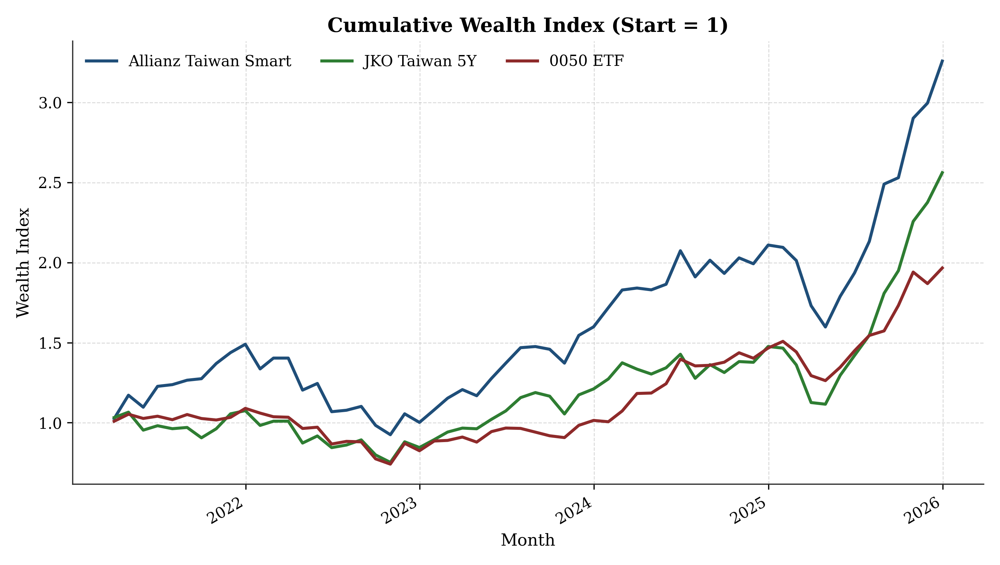
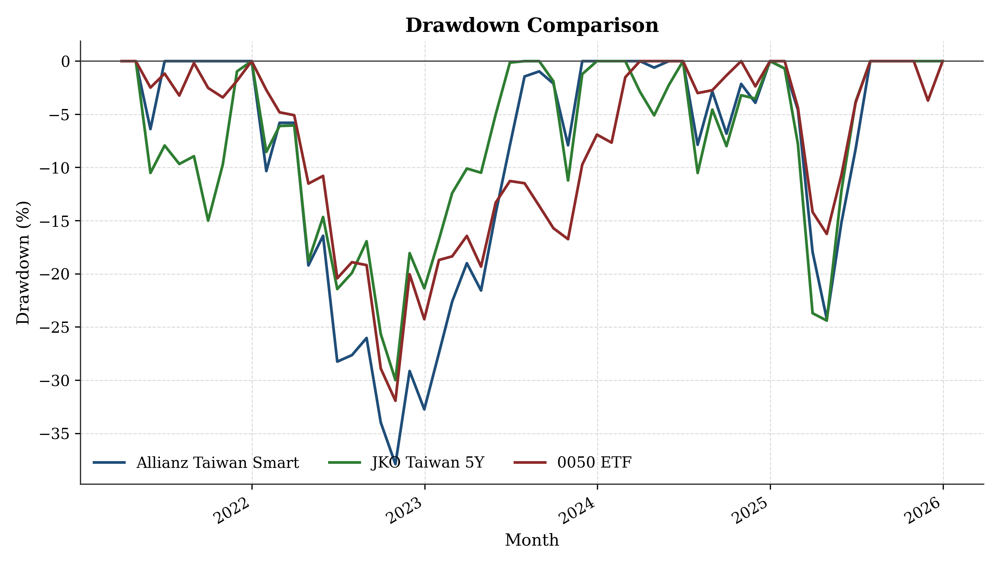
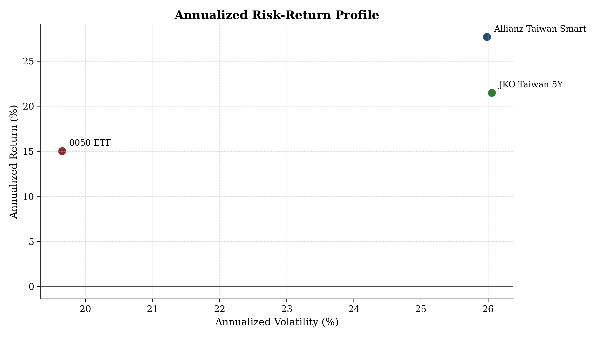
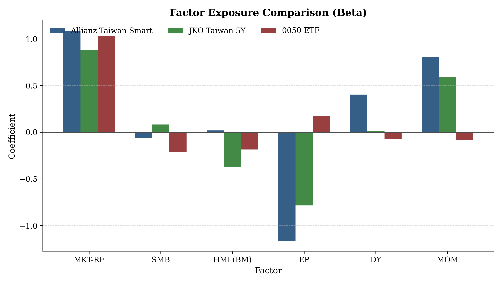
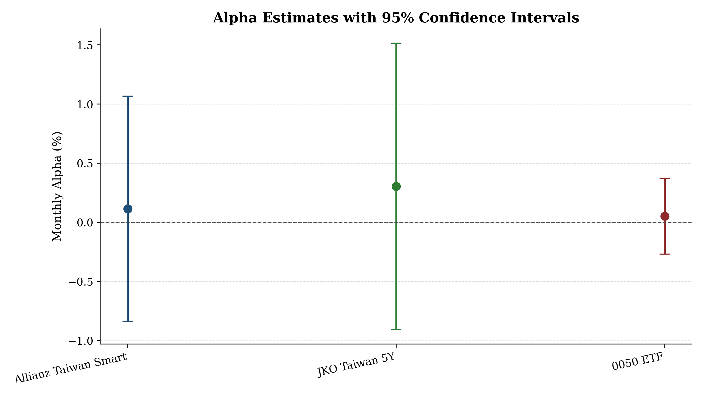
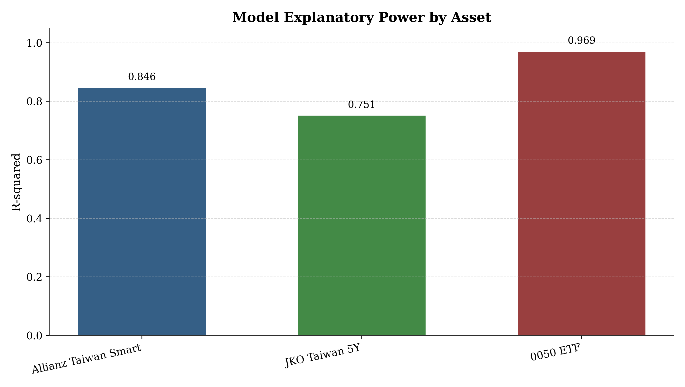

# 六因子模型實證分析報告（Homework 2）

## 1. 研究設定
- 樣本期間：`2021-03` 至 `2025-12`（共 `58` 個月）
- 資料來源：資產價格資料（Bloomberg）與因子資料（TEJ Pro），皆已整理為月頻百分比尺度。
- 模型：`Ri - Rf = alpha + b1*MKT_RF + b2*SMB + b3*HML_BM + b4*EP + b5*DY + b6*MOM + e`
- 比較標的：安聯台灣智慧、街口台灣5年、0050 ETF

## 2. 績效與風險指標
| 標的 | 年化報酬 | 年化波動 | Sharpe | 最大回撤 | 累積報酬 |
| --- | --- | --- | --- | --- | --- |
| 安聯台灣智慧 | 27.69% | 25.98% | 1.024 | -37.88% | 225.85% |
| 街口台灣5年 | 21.49% | 26.06% | 0.828 | -29.98% | 156.20% |
| 0050 ETF | 15.02% | 19.65% | 0.741 | -31.92% | 96.70% |

## 3. 因子描述統計（月頻，單位：%）
| 因子 | 平均 | 標準差 | 變異數 | 最小值 | 最大值 |
| --- | --- | --- | --- | --- | --- |
| MKT-RF | 1.297 | 4.910 | 24.110 | -11.069 | 14.645 |
| SMB | 0.139 | 3.091 | 9.555 | -7.976 | 5.968 |
| HML(BM) | 0.529 | 3.441 | 11.842 | -6.151 | 13.809 |
| EP | 0.252 | 2.843 | 8.084 | -7.061 | 6.983 |
| DY | -0.012 | 2.951 | 8.708 | -6.088 | 6.745 |
| MOM | 1.234 | 3.282 | 10.770 | -6.532 | 7.133 |

## 4. 六因子回歸重點
| 標的 | Alpha(月%) | 95% CI | Alpha p-value | R-squared |
| --- | --- | --- | --- | --- |
| 安聯台灣智慧 | 0.115 | [-0.836, 1.067] | 0.8087 | 0.846 |
| 街口台灣5年 | 0.304 | [-0.908, 1.515] | 0.6169 | 0.751 |
| 0050 ETF | 0.052 | [-0.269, 0.373] | 0.7471 | 0.969 |

- Alpha 判斷：三個標的在 5% 顯著水準下皆未出現顯著正 alpha。
- 風險調整後報酬（Sharpe）最佳：`安聯台灣智慧`。
- 六因子模型解釋力最高：`0050 ETF`（R-squared 最大）。

## 5. 圖表（學術風格 PNG）

## 6. 投資與管理意涵
- 若以「是否具備顯著正 alpha」作為主動管理價值判準，樣本中尚未看到強而穩健的統計證據。
- 若重視風格可解釋性，R-squared 較高者代表報酬主要來自因子暴露而非選股 alpha。
- 建議實務上再搭配滾動視窗回歸與子期間穩健性檢定，以確認風格曝險是否隨時間漂移。

## 7. 主要輸出檔
- `analysis_outputs/tables/asset_performance_summary.csv`
- `analysis_outputs/tables/factor_descriptive_stats.csv`
- `analysis_outputs/tables/regression_coefficients.csv`
- `analysis_outputs/tables/regression_model_stats.csv`
- `analysis_outputs/tables/ols_summary_allianz.txt`
- `analysis_outputs/tables/ols_summary_jko.txt`
- `analysis_outputs/tables/ols_summary_0050.txt`